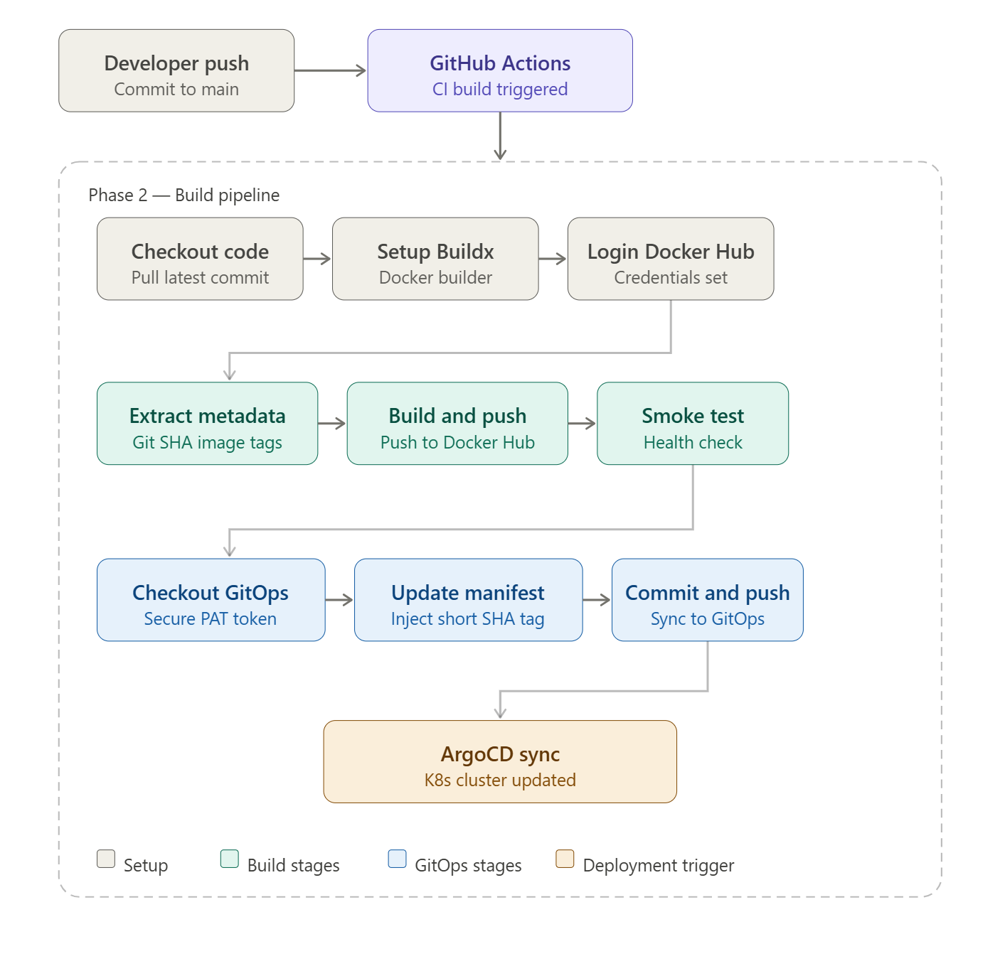

# CI Build & Push Pipeline (GitHub Actions)

The project includes a fully automated CI pipeline located in `.github/workflows/ci.yaml`. This workflow ensures that every code change is validated and containerized before being deployed to the cluster.

### Key Pipeline Stages:

* **Metadata Extraction**: Dynamically generates image tags using the Git SHA (Short) and branch names to ensure every build is unique and traceable.
* **Build & Push**: Compiles the Go application and pushes a tagged image to Docker Hub using the Git SHA for version immutability.
* **Smoke Test (Health Check)**: Runs the newly built image in the runner to verify the app starts and responds correctly before updating the manifest.
* **GitOps Update**: Automatically updates the image tag in the separate GitOps repository to trigger an ArgoCD synchronization.

---

### To use this pipeline in your own forked or cloned repo you must have:

* Docker Hub Account
* GitHub Personal Access Token (PAT) with repo permissions
* Access to the corresponding GitOps Repository

---

## Shared Credentials

> **Note:** If you have already configured your Docker Hub tokens and GitHub Secrets for the "Security Scanning" pipeline, you can skip the "Establish Secrets/Credentials" section below. These credentials are encrypted at the repository level and are automatically available to both pipelines.

---

## Establish Secrets/Credentials (Only if needed)

**Docker Hub Website — Create Access Token:**
- Go to Account Settings > Security
- Click "New Access Token"
- Name: `github-actions-nc-fttx`
- Permissions: Read, Write, Delete
- Copy the token (save it securely)

**Configure Secrets**: In the GitHub Repository, navigate to **Settings > Secrets and variables > Actions** and add the following:

* `DOCKER_USERNAME`: Docker Hub ID.
* `DOCKER_PASSWORD`: Personal Access Token (PAT) *(generated from the Docker Hub account.)*
* `PERSONAL_ACCESS_TOKEN`: A GitHub PAT with (`repo`) scope to allow the runner to push changes to your GitOps repository.

> **Important:** If you are cloning or forking this repo, update the `env:` section in `.github/workflows/ci.yaml` to reflect your own Docker Hub username and repository paths.

---

## Build & Deployment Strategy

For this repo the Security Scanning and Build/Deploy workflows are separated into two distinct YAML files. Typically in a production context the security scanning tools are fully integrated in order to enforce strict quality gates (no pass, no build). By intentionally decoupling these processes, we allow for a full demonstration of the POC while still recognizing and addressing any vulnerabilities if they exist.

---

## The High-Level CI Build Workflow




> **Note on Deployment:** This repository handles Continuous Integration. Once the image is pushed to Docker Hub and the manifest is updated, Continuous Deployment is handled by Repo 2 (GitOps). ArgoCD will detect the new image tag and automatically synchronize the Kubernetes cluster state.

---

## CI Build & Push YAML

### Workflow Initialization

```yaml
on:
  push:
    branches: [main]
    paths: 
      - 'application/**'
      - 'infrastructure/docker/Dockerfile'
  # Optional code for multi-branch environments    
  # pull_request:
  #   branches: [main]
  #   paths: 
  #     - 'application/**'
```

This stage monitors the repo for changes within the application/ tree and the infrastructure Dockerfile to trigger the runner. While optimized for direct pushes to main (for demo purposes), the workflow includes pre-configured optional commented code for Pull Requests—offering an optional safety gate for those who wish to customize for a multi-branch team environment.

---

### Establish Environment Variables

```yaml
env:
  REGISTRY: docker.io
  IMAGE_NAME: nc-fttx-portal
  GITOPS_REPO_PATH: 'nc-fttx-portal-gitops'
  DEPLOYMENT_MANIFEST_PATH: 'manifests/deployment.yaml'
```

Defines global constants available to all steps in the workflow — registry target, image name, and GitOps repository paths.

---

### Job Setup

```yaml
jobs:
  build-and-push:
    runs-on: ubuntu-latest
    
    steps:
    - name: Checkout code
      uses: actions/checkout@v4

    - name: Set up Docker Buildx
      uses: docker/setup-buildx-action@v3

    - name: Login to Docker Hub
      if: github.event_name != 'pull_request'
      uses: docker/login-action@v3
      with:
        username: ${{ secrets.DOCKER_USERNAME }}
        password: ${{ secrets.DOCKER_PASSWORD }}
```

Provisions a fresh Ubuntu runner, configures the Docker builder, and establishes authenticated access to Docker Hub. The login step is gated to skip on pull requests — credentials are only used when a real build and push is required.

---

### Extract Metadata

```yaml
- name: Extract metadata
  id: meta
  uses: docker/metadata-action@v5
  with:
    images: ${{ secrets.DOCKER_USERNAME }}/${{ env.IMAGE_NAME }}
    tags: |
      type=ref,event=branch
      type=ref,event=pr
      type=sha,prefix=sha-
      type=raw,value=latest,enable={{is_default_branch}}
```

Generates a unique identity tag for every build using the Git SHA. Useful for auditing code commits and ensuring every image is traceable back to a specific change.

---

### Build Image & Push

```yaml
- name: Build and push Docker image
  uses: docker/build-push-action@v5
  with:
    context: ./application
    file: ./infrastructure/docker/Dockerfile
    push: ${{ github.event_name != 'pull_request' }}
    tags: ${{ steps.meta.outputs.tags }}
    labels: ${{ steps.meta.outputs.labels }}
    cache-from: type=gha
    cache-to: type=gha,mode=max
```

Builds the application image and pushes it to the registry. Checks for existing cached layers before building from scratch to optimize build times.

---

### Integration Smoke Test

```yaml
- name: Test container
  if: github.event_name != 'pull_request'
  run: |
    docker run -d -p 8080:8080 --name test-container ${{ secrets.DOCKER_USERNAME }}/${{ env.IMAGE_NAME }}:latest
    sleep 10
    curl -f http://localhost:8080/health || exit 1
    docker stop test-container
    docker rm test-container
```

Spins up a test container and attempts to reach the health endpoint, confirming the application can start and handle requests. Prevents a broken image from reaching the registry.

---

### Update Deployment Repo with New Image

```yaml
update-manifest:
  runs-on: ubuntu-latest
  needs: build-and-push
  if: github.event_name == 'push' && github.ref == 'refs/heads/main'
  
  steps:
  - name: Checkout GitOps repository
    uses: actions/checkout@v4
    with:
      repository: jaycloud336/nc-fttx-portal-gitops
      path: ${{ env.GITOPS_REPO_PATH }}
      token: ${{ secrets.PERSONAL_ACCESS_TOKEN }}
```

Checks out the GitOps deployment repository using a PAT token. Only runs if the previous `build-and-push` job succeeds.

---

### Update Image Tag in Deployment Manifest

```yaml
- name: Update image tag in deployment manifest
  run: |
    cd ${{ env.GITOPS_REPO_PATH }}
    SHORT_SHA=$(echo "${{ github.sha }}" | cut -c1-7)
    NEW_TAG="${{ secrets.DOCKER_USERNAME }}/${{ env.IMAGE_NAME }}:sha-${SHORT_SHA}"
    
    sed -i 's|image: .*/nc-fttx-portal:.*|image: '"$NEW_TAG"'|g' ${{ env.DEPLOYMENT_MANIFEST_PATH }}
```

Injects the Short SHA tag into the Kubernetes deployment manifest, ensuring ArgoCD pulls the exact tested version into the cluster.

---

### Commit & Push

```yaml
- name: Commit and push changes
  uses: EndBug/add-and-commit@v9
  with:
    message: 'chore: update application image to sha-${{ github.sha }} [skip ci]'
    cwd: ${{ env.GITOPS_REPO_PATH }}
    add: '${{ env.DEPLOYMENT_MANIFEST_PATH }}'
    default_author: github_actions
```

Commits the updated manifest and pushes it to the GitOps repo. The `[skip ci]` flag prevents a recursive pipeline trigger.

> **Continue to the Deployment Repo here →** https://github.com/jaycloud336/nc-fttx-portal-gitops

---

## Important Note: Production Architecture vs. Repo Implementation

*In a standard enterprise environment, this pipeline would be distributed across multiple environments (Dev, Staging, Prod). For the purpose of this repo, a simplified Single-Branch strategy is used to demonstrate the immediate feedback loop between code changes and GitOps synchronization.*

***Final stage completes the image updates and pushes them to the deployment repo***


## Handoff to Continuous Deployment

Once the manifest commit lands in the GitOps repository, the CI pipeline's responsibility ends. The following lines are what connect the two repos:
```yaml
repository: jaycloud336/nc-fttx-portal-gitops
token: ${{ secrets.PERSONAL_ACCESS_TOKEN }}
```

ArgoCD monitors the GitOps repository and automatically detects the updated image tag in `manifests/deployment.yaml`. No explicit trigger is required — the manifest commit itself initiates the CD process.

> **Continue to the Deployment Repo here →** https://github.com/jaycloud336/nc-fttx-portal-gitops

***Continue to the Deployment Repo here: -->***
https://github.com/jaycloud336/nc-fttx-portal-gitops

## ***Important Note:***

**Production Architecture vs. Repo Implementation**

*In a standard enterprise environment, this pipeline would be distributed across multiple environments (Dev, Staging, Prod). For the purpose of this Repo, a simplified Single-Branch strategy is used to demonstrate the immediate feedback loop between code changes and GitOps synchronization.*