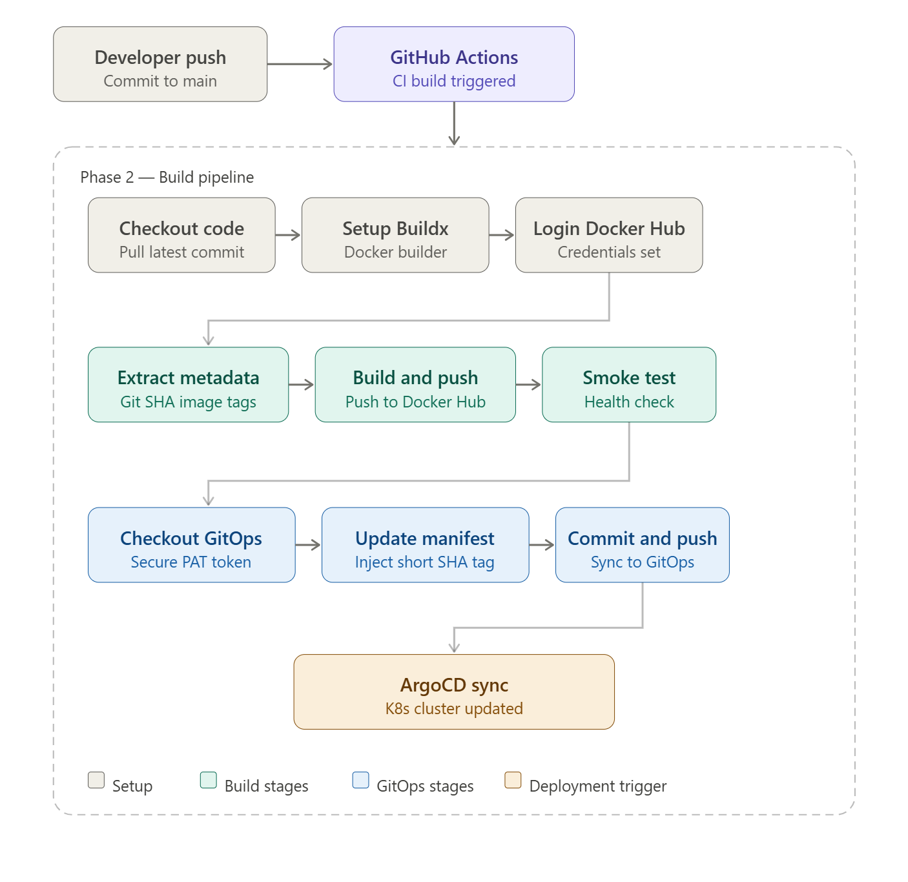

# CI Build & Push Pipeline (GitHub Actions)

The project includes a fully automated CI pipeline located in `.github/workflows/ci-build.yml`. This workflow ensures that every code change is validated and containerized, then updates the GitOps repository that drives deployment.

### Key Pipeline Stages:

* **Metadata Extraction**: Generates image tags using the branch name, the Git SHA (short), and `latest` for the default branch, so every build is traceable.
* **Build & Push**: Compiles the Go application and pushes a tagged image to Docker Hub, using the Git SHA for version immutability.
* **Smoke Test (Health Check)**: Runs the newly built image on the runner to verify the app starts and responds before the manifest is updated.
* **GitOps Update**: Updates the image tag in the separate GitOps repository, which ArgoCD then synchronizes to the cluster.

---

### To use this pipeline in your own forked or cloned repo you must have:

* Docker Hub Account
* GitHub Personal Access Token (PAT) with `repo` (or `public_repo`) scope
* Access to the corresponding GitOps Repository

---

## Shared Credentials

> **Note:** If you have already configured your Docker Hub token and GitHub secrets for the "Security Scanning" pipeline, you can skip the "Establish Secrets/Credentials" section below. These credentials are encrypted at the repository level and are automatically available to both pipelines.

---

## Establish Secrets/Credentials (Only if needed)

**Docker Hub Website, Create Access Token:**
- Go to Account Settings > Security
- Click "New Access Token"
- Name: `gh-actions-nc-fttx`
- Permissions: **Read & Write**
- Copy the token (save it securely)

**Configure Secrets**: In the GitHub Repository, navigate to **Settings > Secrets and variables > Actions** and add:

* `DOCKER_USERNAME`: Docker Hub ID.
* `DOCKER_PASSWORD`: Docker Hub access token *(generated from the Docker Hub account).*
* `PERSONAL_ACCESS_TOKEN`: A GitHub PAT with `repo` (or `public_repo`) scope, allowing the runner to commit to the GitOps repository.

> **Token expiry:** Both the Docker Hub token and the GitHub PAT expire. If the pipeline fails at "Login to Docker Hub" or "Checkout GitOps repository," regenerate the relevant token and update its secret.

> **Important:** If you are cloning or forking this repo, update the `env:` section in `.github/workflows/ci-build.yml` to reflect your own Docker Hub username and repository paths.

---

## Build & Deployment Strategy

The Security Scanning and Build/Deploy workflows are separated into two distinct YAML files. In a production context, security scanning is typically integrated as a blocking gate (no pass, no build). By intentionally decoupling these processes, this repo allows a full demonstration of the POC. The build pipeline runs end-to-end even when scans surface warnings, while still recognizing and addressing vulnerabilities independently.

---

## The High-Level CI Build Workflow



> **Note on Deployment:** This repository handles Continuous Integration. Once the image is pushed to Docker Hub and the manifest is updated, Continuous Deployment is handled by Repo 2 (GitOps). ArgoCD detects the new image tag and automatically synchronizes the Kubernetes cluster state.

---

## CI Build & Push YAML

### Workflow Initialization

```yaml
on:
  push:
    branches: [main]
    paths:
      - 'application/**'
      - 'infrastructure/docker/Dockerfile'
  # Optional code for multi-branch environments
  # pull_request:
  #   branches: [main]
  #   paths:
  #     - 'application/**'
```

This stage monitors the repo for changes within the `application/` tree and the infrastructure Dockerfile to trigger the runner. Optimized for direct pushes to `main` (for demo purposes), the workflow includes pre-configured, commented-out Pull Request code as an optional safety gate for a multi-branch team environment.

---

### Establish Environment Variables

```yaml
env:
  REGISTRY: docker.io
  IMAGE_NAME: nc-fttx-portal
  GITOPS_REPO_PATH: 'nc-fttx-portal-gitops'
  DEPLOYMENT_MANIFEST_PATH: 'manifests/deployment.yaml'
```

Defines global constants available to all steps: registry target, image name, and GitOps repository paths.

---

### Job Setup

```yaml
jobs:
  build-and-push:
    runs-on: ubuntu-latest

    steps:
    - name: Checkout code
      uses: actions/checkout@v4

    - name: Set up Docker Buildx
      uses: docker/setup-buildx-action@v3

    - name: Login to Docker Hub
      if: github.event_name != 'pull_request'
      uses: docker/login-action@v3
      with:
        username: ${{ secrets.DOCKER_USERNAME }}
        password: ${{ secrets.DOCKER_PASSWORD }}
```

Provisions a fresh Ubuntu runner, configures the Docker builder, and establishes authenticated access to Docker Hub. The login step is gated to skip on pull requests, so credentials are only used when a real build and push is required.

---

### Extract Metadata

```yaml
- name: Extract metadata
  id: meta
  uses: docker/metadata-action@v5
  with:
    images: ${{ secrets.DOCKER_USERNAME }}/${{ env.IMAGE_NAME }}
    tags: |
      type=ref,event=branch
      type=ref,event=pr
      type=sha,prefix=sha-
      type=raw,value=latest,enable={{is_default_branch}}
```

Generates the image tags from the run context: the branch name, the short Git SHA (`sha-<short>`), and `latest` when the build is on the default branch. This makes every image traceable back to a specific commit.

---

### Build Image & Push

```yaml
- name: Build and push Docker image
  uses: docker/build-push-action@v5
  with:
    context: ./application
    file: ./infrastructure/docker/Dockerfile
    push: ${{ github.event_name != 'pull_request' }}
    tags: ${{ steps.meta.outputs.tags }}
    labels: ${{ steps.meta.outputs.labels }}
    cache-from: type=gha
    cache-to: type=gha,mode=max
```

Builds the application image and pushes it to the registry. GitHub Actions cache is used to reuse existing layers and speed up repeat builds.

---

### Integration Smoke Test

```yaml
- name: Test container
  if: github.event_name != 'pull_request'
  run: |
    docker run -d -p 8080:8080 --name test-container ${{ secrets.DOCKER_USERNAME }}/${{ env.IMAGE_NAME }}:latest
    sleep 10
    curl --retry 5 --retry-delay 2 --fail http://localhost:8080/health || (docker logs test-container && exit 1)
    docker stop test-container
    docker rm test-container
```

Spins up the just-built image and polls the `/health` endpoint with retries, confirming the app can start and handle requests. If the container fails to respond, the step dumps its logs and fails the job, preventing a broken image from proceeding.

---

### Update Deployment Repo with New Image

```yaml
update-manifest:
  runs-on: ubuntu-latest
  needs: build-and-push
  if: github.event_name == 'push' && github.ref == 'refs/heads/main'

  steps:
  - name: Checkout GitOps repository
    uses: actions/checkout@v4
    with:
      repository: jaycloud336/nc-fttx-portal-gitops
      path: ${{ env.GITOPS_REPO_PATH }}
      token: ${{ secrets.PERSONAL_ACCESS_TOKEN }}
```

A separate job on its own fresh runner. `needs: build-and-push` gates it on the build succeeding, and the `if:` condition restricts it to pushes on `main`. It checks out the GitOps deployment repository using the PAT, which is required because it is a different repo from the one the workflow runs in.

---

### Update Image Tag in Deployment Manifest

```yaml
- name: Update image tag in deployment manifest
  run: |
    cd ${{ env.GITOPS_REPO_PATH }}
    SHORT_SHA=$(echo "${{ github.sha }}" | cut -c1-7)
    NEW_TAG="${{ secrets.DOCKER_USERNAME }}/${{ env.IMAGE_NAME }}:sha-${SHORT_SHA}"

    sed -i 's|image: .*/nc-fttx-portal:.*|image: '"$NEW_TAG"'|g' ${{ env.DEPLOYMENT_MANIFEST_PATH }}
```

Rebuilds the same short-SHA tag that was pushed to Docker Hub and writes it into the deployment manifest's `image:` field, so the deployment references the exact tested build.

---

### Commit & Push

```yaml
- name: Commit and push changes
  uses: EndBug/add-and-commit@v9
  with:
    message: 'chore: update application image to sha-${{ github.sha }} [skip ci]'
    cwd: ${{ env.GITOPS_REPO_PATH }}
    add: '${{ env.DEPLOYMENT_MANIFEST_PATH }}'
    default_author: github_actions
```

Commits the updated manifest and pushes it to the GitOps repo. The `[skip ci]` flag prevents a recursive pipeline trigger.

---

## Handoff to Continuous Deployment

Once the manifest commit lands in the GitOps repository, the CI pipeline's responsibility ends. The lines that connect the two repos are:

```yaml
repository: jaycloud336/nc-fttx-portal-gitops
token: ${{ secrets.PERSONAL_ACCESS_TOKEN }}
```

ArgoCD monitors the GitOps repository and automatically detects the updated image tag in `manifests/deployment.yaml`. No explicit trigger is required, as the manifest commit itself initiates the CD process.

> **Continue to the Deployment Repo:** https://github.com/jaycloud336/nc-fttx-portal-gitops

---

## Important Note: Production Architecture vs. Repo Implementation

In a standard enterprise environment, this pipeline would be distributed across multiple environments (Dev, Staging, Prod). For this repo, a simplified single-branch strategy is used to demonstrate the immediate feedback loop between code changes and GitOps synchronization.