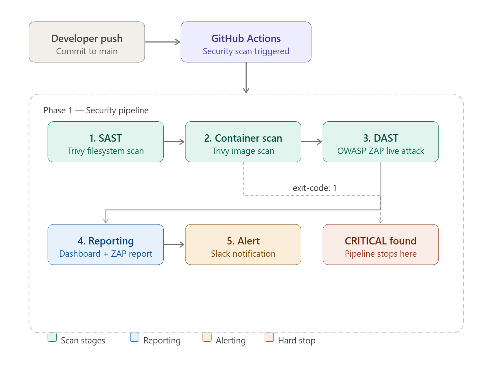

# CI/CD Pipeline & Security Automation Overview

This document provides a technical breakdown of the automated security pipeline located in `.github/workflows/security-scan.yml`. This workflow validates every code change using a "Shift-Left" security approach.

---

## Prerequisites for Use

To execute this pipeline in a forked or cloned repository, the following are required:

- **Docker**
- **Docker Hub Account**
- **Slack Account** *(Optional, for notifications)*

---

## Establish Secrets & Credentials

Navigate to **Settings > Secrets and variables > Actions** in your GitHub repository and configure the following:

1. **Docker Hub Credentials**:
  , `DOCKER_USERNAME`: Your Docker Hub ID.
  , `DOCKER_PASSWORD`: A Docker Hub access token (*Account Settings > Security > New Access Token*, Read & Write).

2. **Slack Integration (Optional)**:
  , `SLACK_WEBHOOK_URL`: The webhook URL from a Slack App with "Incoming Webhooks" enabled.

> These secrets are shared at the repository level and are automatically available to both the security and build/deploy workflows.

---

## Security Scanning Architecture

### Modular vs. Unified Design

In a standard enterprise environment, security scans are typically "blocking" steps within a single unified pipeline. For this project, a **Modular Architecture** is used instead.

Decoupling the security scanning from the build/deploy workflow allows a full demonstration of the security POC while identifying and addressing vulnerabilities independently of the artifact engineering process. It also means the build pipeline can run end-to-end for demonstration even when the scans surface warnings.

### High-Level Workflow

**Developer (Push)** ➡️ **GitHub Actions (Security Scan)**



**Phase 1: Security Pipeline (Testing/Validation)**

1. Dependency Scan (SCA): Trivy Filesystem Scan ➡️
2. Container Scan: Trivy Image Scan ➡️
3. DAST: OWASP ZAP (Live Scan) ➡️
4. Reporting: Dashboard Generation + Artifact Upload ➡️
5. Alert: Slack Notification (Warnings/Failure)

**To explore the Build Pipeline (Artifact Creation)** (see `.github/workflows/ci-build.yml`):

1. Build: Go Multi-Stage Docker Build ➡️
2. Registry: Push to Docker Hub (`:latest`, `:main`, `:sha-<short>`) ➡️
3. GitOps: manifest update in the deployment repo (the ArgoCD "trigger")

> **Deployment Note:** This repository handles Continuous Integration only. Once the image is pushed to Docker Hub, a separate GitOps repository (https://github.com/jaycloud336/nc-fttx-portal-gitops) handles Continuous Deployment. ArgoCD detects the new image tag and automatically synchronizes the Kubernetes cluster state.

---

## Security Scan Workflow Breakdown (`security-scan.yml`)

### 1. Trigger & Permissions

The workflow triggers on every push or pull request to the `main` branch. Running on pull requests as well as pushes is a deliberate shift-left choice, vulnerabilities are surfaced during review, before code merges. Least-privilege permissions are granted for writing security events and creating dashboard summaries.

> **Note:** This workflow is intended for demonstration purposes and is not recommended for production use as-is.

```yaml
on:
  push:
    branches: [main]
  pull_request:
    branches: [main]

jobs:
  security-scan:
    runs-on: ubuntu-latest
    permissions:
      contents: read
      issues: write
      actions: write
      security-events: write
```

---

### 2. Dependency Scan (SCA), Filesystem Scan

This step scans the application's dependency declarations (`go.mod`, `go.sum`) and project files for known vulnerabilities (CVEs) in third-party packages, plus a secret scan. This is Software Composition Analysis (SCA), it assesses the components the app pulls in, not the application's own source logic.

The action is pinned to a specific release (`@v0.35.0`) rather than a moving branch, for reproducibility and supply-chain safety.

```yaml
- name: Run Trivy vulnerability scanner
  uses: aquasecurity/trivy-action@v0.35.0
  with:
    scan-type: 'fs'
    scan-ref: './application'
    format: 'table'
```

---

### 3. Container Image Scanning

A local image tagged `:scan` is built and audited. Trivy inspects the OS layers (Alpine) and the Go binary for known CVEs. The step returns a non-zero exit code if a CRITICAL vulnerability is found, a hard gate that fails the job. The step is given an `id` so the dashboard can read its outcome.

```yaml
- name: Build Docker image for scanning
  run: |
    docker build -f infrastructure/docker/Dockerfile -t nc-fttx-portal:scan ./application

- name: Run Trivy container scan
  id: trivy-image
  uses: aquasecurity/trivy-action@v0.35.0
  with:
    image-ref: 'nc-fttx-portal:scan'
    format: 'table'
    exit-code: '1'
    severity: 'CRITICAL'
```

---

### 4. Dynamic Analysis (DAST), OWASP ZAP

The application is started in a container to test live behavior. Rather than a fixed wait, the pipeline polls the `/health` endpoint until the app responds (up to a 60-second cap), so ZAP scans a fully-started app without wasting time. OWASP ZAP then runs a baseline scan against the running endpoint to find issues such as missing security headers, information disclosure, and other runtime findings.

`continue-on-error: true` ensures the pipeline continues past this step regardless of findings, while still recording the step outcome for the Slack condition downstream. The ZAP action (v0.14.0) uploads its own HTML/Markdown/JSON report as an artifact via the `artifact_name` input.

```yaml
- name: Start application for DAST
  run: |
    docker run -d -p 8080:8080 --name test-app nc-fttx-portal:scan
    for i in $(seq 1 30); do
      curl -sf http://localhost:8080/health && break
      sleep 2
    done

- name: Run OWASP ZAP baseline scan
  id: zap-scan
  uses: zaproxy/action-baseline@v0.14.0
  with:
    target: 'http://localhost:8080'
    allow_issue_writing: false
    artifact_name: zap-scan-report
  continue-on-error: true
```

> **Report artifact:** The ZAP report (`zap-scan-report`) is available in the **Artifacts** section at the bottom of the workflow run page. A separate manual upload step is not required, the ZAP action handles it. (v0.14.0 fixes an artifact-upload failure present in v0.13.0, which shipped a deprecated `upload-artifact` dependency.)

---

### 5. Automated Dashboard Summary

This step reduces "log fatigue" by generating a human-readable table directly on the GitHub Actions run page. The values are read live from the scan results: the Trivy row reflects the image-scan step's actual outcome, and the ZAP row parses the High/Medium/Low counts from the JSON report (`jq` is preinstalled on the runner).

```yaml
- name: Generate Dashboard Summary
  if: always()
  run: |
    if [ -f report_json.json ]; then
      HIGH=$(jq '[.site[].alerts[] | select(.riskcode=="3")] | length' report_json.json)
      MED=$(jq '[.site[].alerts[] | select(.riskcode=="2")] | length' report_json.json)
      LOW=$(jq '[.site[].alerts[] | select(.riskcode=="1")] | length' report_json.json)
      ZAP_SUMMARY="High: ${HIGH}, Medium: ${MED}, Low: ${LOW}"
    else
      ZAP_SUMMARY="Report not found"
    fi

    if [ "${{ steps.trivy-image.outcome }}" = "success" ]; then
      TRIVY_STATUS="✅ PASS"
      TRIVY_NOTE="No critical vulnerabilities found."
    else
      TRIVY_STATUS="❌ FAIL"
      TRIVY_NOTE="Critical vulnerabilities detected - see logs."
    fi

    echo "### 🛡️ Security Scan Dashboard" >> $GITHUB_STEP_SUMMARY
    echo "" >> $GITHUB_STEP_SUMMARY
    echo "| Scanner | Status | Findings |" >> $GITHUB_STEP_SUMMARY
    echo "| :--- | :--- | :--- |" >> $GITHUB_STEP_SUMMARY
    echo "| **Trivy (Image)** | \${TRIVY_STATUS} | \${TRIVY_NOTE} |" >> $GITHUB_STEP_SUMMARY
    echo "| **OWASP ZAP (DAST)** | ⚠️ WARNING | \${ZAP_SUMMARY} |" >> $GITHUB_STEP_SUMMARY
    echo "" >> $GITHUB_STEP_SUMMARY
    echo "Check the **Artifacts** section at the bottom of this page to download the full HTML report." >> $GITHUB_STEP_SUMMARY
```

---

### 6. Notification & Cleanup

`if: always()` ensures the test container is removed regardless of outcome.

Slack notifications fire on two independent conditions, a hard upstream step failure via `failure()`, or a ZAP step outcome of `failure`. Either one alone triggers the alert. Because the ZAP step runs with `continue-on-error: true`, warning-level findings can register the outcome that trips this alert even when nothing critical failed; tuning it to alert only on genuine failures is a planned refinement.

```yaml
- name: Cleanup test container
  if: always()
  run: docker rm -f test-app

- name: Notify Slack on security issues
  if: failure() || steps.zap-scan.outcome == 'failure'
  uses: 8398a7/action-slack@v3
  with:
    status: failure
    text: "Security vulnerabilities detected in nc-fttx-portal"
  env:
    SLACK_WEBHOOK_URL: ${{ secrets.SLACK_WEBHOOK_URL }}
```

> Example webhook format: `https://hooks.slack.com/services/<YOUR_HOOK_HERE>`

---

### 7. Static Analysis (SAST) — CodeQL

Static analysis of the Go source runs in its own workflow (`codeql.yml`), separate
from this pipeline. It scans the application's own code for security bugs and coding
errors — the layer that Trivy (dependencies/image) and ZAP (runtime) don't cover.
Findings post to the repository Security tab under Code scanning alerts.

​```yaml
# .github/workflows/codeql.yml (excerpt)
- name: Initialize CodeQL
  uses: github/codeql-action/init@v3
  with:
    languages: go

- name: Autobuild
  uses: github/codeql-action/autobuild@v3    # compiles Go so CodeQL can analyze it

- name: Perform CodeQL Analysis
  uses: github/codeql-action/analyze@v3      # runs queries, uploads to Security tab
​```

> **Architecture Note:** In a standard enterprise environment, direct pushes to `main` are blocked. This repository uses a simplified single-branch strategy to demonstrate the immediate feedback loop between code changes, security scanning, and GitOps synchronization.